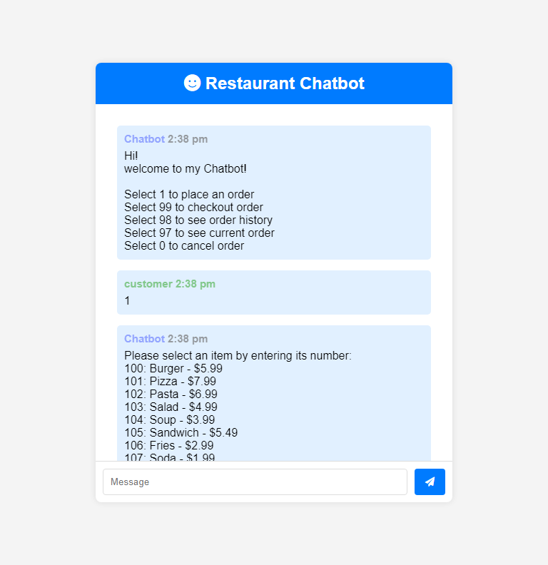

# Overview

chatBot is a real-time ordering system built with Node.js, Express, Socket.IO, and MongoDB. It facilitates interactive ordering, menu browsing, order management, and session tracking through WebSocket communication.

## Features

- **Real-Time Communication**: Uses Socket.IO to enable instant communication between clients and the server.
- **Database Integration**: MongoDB with Mongoose for storing session data and order histories.
- **Static Files**: Express serves static assets (HTML, CSS, client-side JavaScript).
- **Order Management**: Place orders, view current orders, and access order history.
- **Session Management**: Manage user sessions with unique identifiers stored in MongoDB.

### Screenshot

# Links

- Solution URL: [https://chatbot-pwxi.onrender.com/]

# Built with

- Semantic HTML5 markup
- CSS custom properties
- Nodejs
- Express
- Socket.IO
- MongoDB with Mongoose
